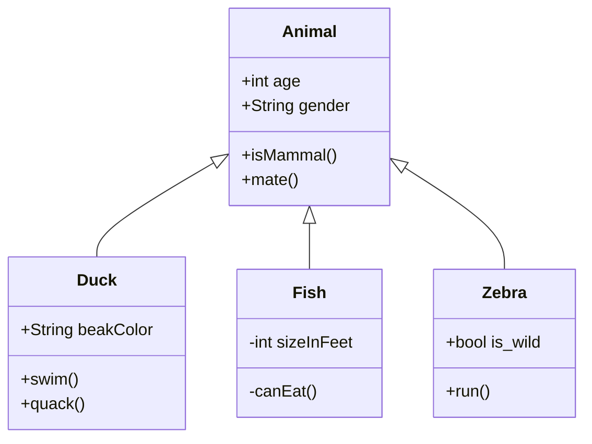

# Clara Duverger's homepage !

Welcome to my website! I am currently a **Seismologist** / **Seismic hazard engineer** working in France.
My *research interests* concern:

- seismic hazard computation,
- statistical analysis of background seismicity,
- declustering and modelling of earthquake catalogs,
- relocation of seismic swarms to image tectonical structures.

---

## Communications

### Publications

**Duverger, C.**, Lambotte, S., Bernard, P., Lyon-Caen, H., Deschamps, A., & Nercessian, A. (**2018**). Dynamics of microseismicity and its relationship with the active structures in the western Corinth Rift (Greece). *Geophysical Journal International, 215*(1), 196-221. [Link](https://academic.oup.com/gji/article-abstract/215/1/196/5046732)

**Duverger, C.**, Godano, M., Bernard, P., Lyon‐Caen, H., & Lambotte, S. (**2015**). The 2003–2004 seismic swarm in the western Corinth rift: Evidence for a multiscale pore pressure diffusion process along a permeable fault system. *Geophysical Research Letters, 42*(18), 7374-7382. [Link](https://agupubs.onlinelibrary.wiley.com/doi/full/10.1002/2015GL065298)

### Peer Review Activity
- for Journal of Geophysical Research - Solid Earth

### PhD Thesis

**Duverger, C.** (**2017**). *Sismicité, couplages sismique-asismiques et processus transitoires de déformation dans un système de failles actives: le rift de Corinthe, Grèce*. Doctoral dissertation. [Link](https://hal.inria.fr/tel-02151611/)

### Talks

Vallage, A., Bollinger, L., Cano, Y., Champenois, J., **Duverger, C.**, Hernandez, B., Herry, P., Le Pichon, A., Listowski, C., Mazet-Roux, G., Menager, M., Merrer, S., Pinel-Puyssegur, B., Rusch, R., Sebe, O., Vergoz, J., Guilhem Trilla, A. (May **2020**). Full characterization of the ML 5.4 2019/11/11 Le Teil earthquake in France based on a multi-technology approach. **EGU** General Assembly.

Keller, M., Mayor, J., **Duverger, C.**, Senfaute, G. (September **2019**). Bayesian model comparison applied to probabilistic seismic hazard assessment. **ENBIS**, 19th Annual Conference.

**Duverger, C.**, Bernard, P., Lambotte, S., Godano, M., Lyon-Caen, H., Deschamps, A., Nercessian, A. (September **2018**). Dynamics of micro-earthquake multiplets linked to active faults in the western Corinth Rift, Greece. **ESC** 36th General Assembly.

**Duverger, C.**, Bernard, P., Lambotte, S., Godano, M., Lyon-Caen, H. (December **2016**). Triggering Processes of Microearthquake Swarms in the western Corinth Rift, Greece. **AGU** Fall Meeting.

**Duverger, C.**, Bernard, P., Lyon-Caen, H., Deschamps, A., Lambotte, S., Godano, M., Nercessian, A. (June **2016**). Earthquake multiplets and dynamic triggering in the western Corinth Rift, Greece. **CMG**, 31st IUGG Conference.

### Posters

**Duverger, C.**, Vallage, A., Bollinger, L. (April **2019**). Uncertainties on fault parameters and seismotectonic source zones for site-specific PSHA in southeastern France. **SSA** Annual meeting.

**Duverger, C.**, Bernard, P., Colombelli, S., Zollo, A. (April **2019**). Rupture initiation of small earthquakes in the Corinth Rift, Greece. **SSA** Annual meeting.

**Duverger, C.**, Godano, M., Bernard, P., & LYON-CAEN, H. (September **2014**). Analysis of earthquake multiplets in the western Corinth rift (Greece) during the 2003-2004 seismic crisis. **ESC** 34th General Assembly.

### International Conferences

- EGU 2020, General assembly - *Online*
- SSA 2019, Annual meeting - Seattle, USA
- ESC 2018, 36th General assembly - Valleta, Malta
- AGU 2016, Fall meeting - San Francisco, USA
- CMG 2016, 31st IUGG Conference - Paris, France
- ESC 2014, 34th General assembly - Istanbul, Turkey

### International Workshops or Schools

- Workshop "PSHA testing", Symposium Project Sigma-2 (December 2019) - Saclay, France
- Workshop "Best PSHANI", Project SINAPS@ (May 2018) - Cadarache, France
- International Training Course, Project SINAPS@ (April 2018) - Porquerolles, France
- Workshop "Earthquakes: nucleation, triggering rupture and aseismic processes" (October 2015) - Cargèse, France

---

## Projects

### OpenQuake

#### OpenQuake Engine

Some helps for OpenQuake beginners:
[Openquake help page](https://github.com/claraduverger/openquake-help)

#### OpenQuake and QGis

The OpenQuake Integrated Risk Modelling Toolkit (IRMT) is a QGis plug-in is developed by the Global Earthquake Model (GEM) Foundation.
[OpenQuake IRMT help page](https://github.com/claraduverger/oq-irmt-help)

### Python HPC

Training delivered by PRACE:
[Python in High Performance Computing](https://github.com/claraduverger/hpc-python)

